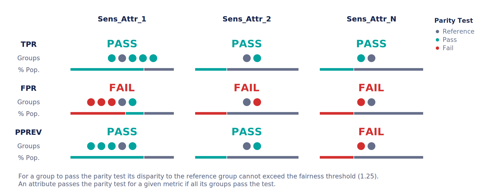
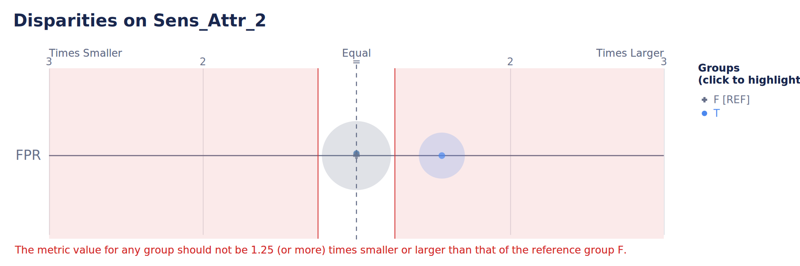

# *Aequitas*: Bias Auditing & Fair ML Toolkit

[](https://pypi.python.org/pypi/aequitas/)
[](https://pypi.org/project/aequitas/)
[](https://github.com/python/black)

[comment]: <> (Add badges for coverage when we have tests, update repo for other types of badges!)


<p align="center">
  
</p>


`aequitas` is an open-source bias auditing and Fair ML toolkit for data scientists, machine learning researchers, and policymakers. The objective of this package is to provide an easy-to-use and transparent tool for auditing predictors, as well as experimenting with Fair ML methods in binary classification settings.


## 📥 Installation

```cmd
pip install aequitas
```

or

```cmd
pip install git+https://github.com/dssg/aequitas.git
```

### 🔍 Quickstart on Bias Auditing

To perform a bias audit, you need a pandas `DataFrame` with the following format:

|     | label | score | sens_attr_1 | sens_attr_2 | ... | sens_attr_N |
|-----|-------|-------|-------------|-------------|-----|-------------|
| 0   | 0     | 0     | A           | F           |     | Y           |
| 1   | 0     | 1     | C           | F           |     | N           |
| 2   | 1     | 1     | B           | T           |     | N           |
| ... |       |       |             |             |     |             |
| N   | 1     | 0     | E           | T           |     | Y           |

where `label` is the target variable for your prediction task and `score` is the model output.
Only one sensitive attribute is required; all must be in `Categorical` format.

```python
from aequitas import Audit

audit = Audit(df)
```

To obtain a summary of the bias audit, run:
```python
# Select the fairness metric of interest for your dataset
audit.summary_plot(["tpr", "fpr", "pprev"])
```


We can also observe a single metric and sensitive attribute:
```python
audit.disparity_plot(attribute="sens_attr_2", metrics=["fpr"])
```


### 🧪 Quickstart on Fair ML Experimenting

To perform an experiment, a dataset is required. It must have a label column, a sensitive attribute column, and features.  

```python
from aequitas.flow import DefaultExperiment

experiment = DefaultExperiment(dataset, label="label", s="sensitive_attribute")
experiment.run()
```
Several aspects of an experiment (*e.g.*, algorithms, number of runs, dataset splitting) can be configured individually.

[comment]: <> (Make default experiment this easy to run)

### 🧠 Quickstart on Method Training

Assuming an `aequitas.flow.Dataset`, it is possible to train methods and use their functionality depending on the type of algorithm (pre-, in-, or post-processing).

For pre-processing methods:
```python
from aequitas.flow.methods.preprocessing import PrevalenceSampling

sampler = PrevalenceSampling()
sampler.fit(dataset.train.X, dataset.train.y, dataset.train.s)
X_sample, y_sample, s_sample = sampler.transform(dataset.train.X, dataset.train.y, dataset.train.s)
```

for in-processing methods:
```python
from aequitas.flow.methods.inprocessing import FairGBM

model = FairGBM()
model.fit(X_sample, y_sample, s_sample)
scores_val = model.predict_proba(dataset.validation.X, dataset.validation.y, dataset.validation.s)
scores_test = model.predict_proba(dataset.test.X, dataset.test.y, dataset.test.s)
```

for post-processing methods:
```python
from aequitas.flow.methods.postprocessing import BalancedGroupThreshold

threshold = BalancedGroupThreshold("top_pct", 0.1, "fpr")
threshold.fit(dataset.validation.X, scores_val, dataset.validation.y, dataset.validation.s)
corrected_scores = threshold.transform(dataset.test.X, scores_test, dataset.test.s)
```

With this sequence, we would sample a dataset, train a FairGBM model, and then adjust the scores to have equal FPR per group (achieving Predictive Equality).

## 📜 Features of the Toolkit
- **Metrics**: Audits based on confusion matrix-based metrics with flexibility to select the more important ones depending on use-case.
- **Plotting options**: The major outcomes of bias auditing and experimenting offer also plots adequate to different user objectives. 
- **Fair ML methods**: Interface and implementation of several Fair ML methods, including pre-, in-, and post-processing methods.
- **Datasets**: Two "families" of datasets included, named [BankAccountFraud](https://arxiv.org/pdf/2211.13358) and [FolkTables](https://arxiv.org/abs/2108.04884).
- **Extensibility**: Adapted to receive user-implemented methods, with intuitive interfaces and method signatures.
- **Reproducibility**: Option to save artifacts of Experiments, from the transformed data to the fitted models and predictions.
- **Modularity**: Fair ML Methods and default datasets can be used individually or integrated in an `Experiment`.
- **Hyperparameter optimization**: Out of the box integration and abstraction of [Optuna](https://github.com/optuna/optuna)'s hyperparameter optimization capabilities for experimentation.

### Fair ML Methods

We support a range of methods designed to address bias and discrimination in different stages of the ML pipeline.

|Type           |Method                  |Description |
|---------------|------------------------|------------|
|Pre-processing |Data Repairer           |Transforms the data distribution so that a given feature distribution is more or less independent of the sensitive attribute *s*.|
|               |Label Flipping          |Flips the labels of a fraction of the training data according to the Fair Ordering-Based Noise Correction method.|
|               |Prevalence Sampling     |Generates training sample with balanced prevalence for the groups in dataset.|
|In-processing  |FairGBM                 |Novel method where a boosting trees algorithm (LightGBM) is subject to pre-defined fairness constraints.|
|               |Fairlearn Classifier    |Creates a model from the Fairlearn package. Especially designed for the ExponentiatedGradient and GridSearch methods.|
|Post-processing|Group Threshold         |Adjustes the prediction scores based on a threshold for multiple groups in the dataset.|
|               |Balanced Group Threshold|

### Fairness Metrics

`aequitas` provides the value of confusion matrix metrics (referred as $\text{CM}$)  for each possible value of the sensitive attribute columns. To calculate fairness metrics, ratios between two groups are calculated.
We provide an example of how the `Audit` class operates to obtain the metrics:

| Operation                             | Result                                                                                |
|---------------------------------------|---------------------------------------------------------------------------------------|
| Calculate $\text{CM}$ for every group | Dataframe with confusion matrix metrics $\text{CM}_a, \text{CM}_b, ..., \text{CM}_N$. |
| Selecting the reference group         | Either majority group, group with min metric or user-selected, $\text{CM}_{r}$.       |
| Calculating disparities               | Dataframe with ratios between each group and the reference group, $\dfrac{\text{CM}_a}{\text{CM}_r} , \dfrac{\text{CM}_b}{\text{CM}_r}, ..., \dfrac{\text{CM}_N}{\text{CM}_r}$ |
| Selecting the metric(s) of interest   | Summaries, plots, or tables of the results.                                           |


### Use Cases and examples

| Use Case | Description |
|-|-|
| [Auditing Predictions](https://colab.research.google.com/github/dssg/aequitas/blob/notebooks/compas_demo.ipynb) | Check how to do an in-depth bias audit with the COMPAS example notebook. |
| [Auditing and correcting a trained model](https://colab.research.google.com/github/dssg/aequitas/blob/notebooks/aequitas_flow_model_audit_and_correct.ipynb) | Create a dataframe to audit a specific model, and correct the predictions with group-specific thresholds in the Model correction notebook. |
| [Running a Fair ML Experiment](https://colab.research.google.com/github/dssg/aequitas/blob/notebooks/aequitas_flow_experiment.ipynb) | Experiment with your own dataset or methods and check the results of a Fair ML experiment. |

## Further documentation

You can find the toolkit documentation [here](https://dssg.github.io/aequitas/).

For more examples of the python library and a deep dive on concepts of fairness in ML, see our [Tutorial](https://github.com/dssg/fairness_tutorial) presented on KDD and AAAI. Visit also the [Aequitas project website](http://dsapp.uchicago.edu/aequitas/).

## Citing Aequitas


If you use Aequitas in a scientific publication, we would appreciate citations to the following paper:

Pedro Saleiro, Benedict Kuester, Abby Stevens, Ari Anisfeld, Loren Hinkson, Jesse London, Rayid Ghani, Aequitas: A Bias and Fairness Audit Toolkit,  arXiv preprint arXiv:1811.05577 (2018). ([PDF](https://arxiv.org/pdf/1811.05577.pdf))

```bib
   @article{2018aequitas,
     title={Aequitas: A Bias and Fairness Audit Toolkit},
     author={Saleiro, Pedro and Kuester, Benedict and Stevens, Abby and Anisfeld, Ari and Hinkson, Loren and London, Jesse and Ghani, Rayid}, journal={arXiv preprint arXiv:1811.05577}, year={2018}}
``` 

[Back to top](#aequitas-bias-auditing--fair-ml-toolkit)
