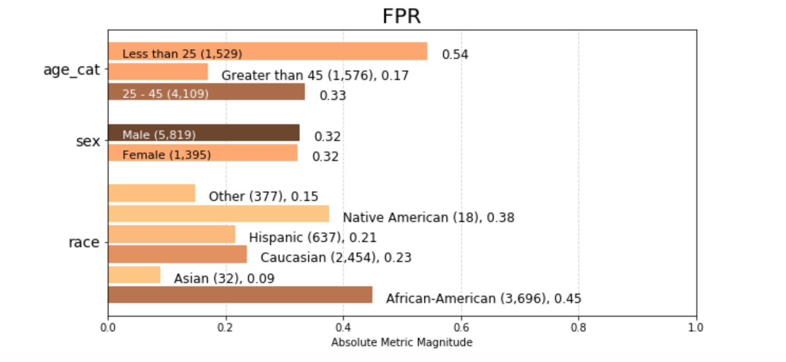
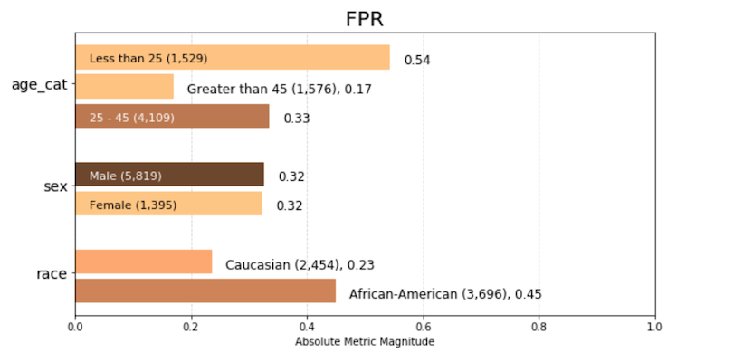
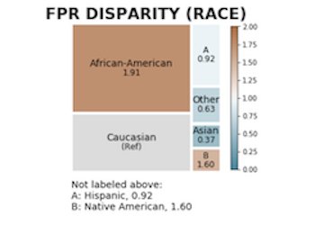
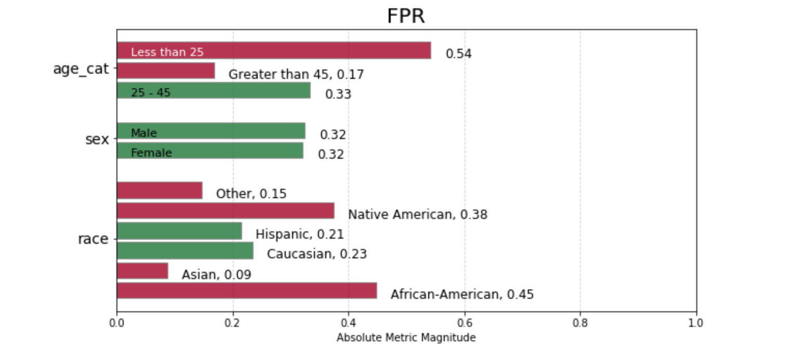
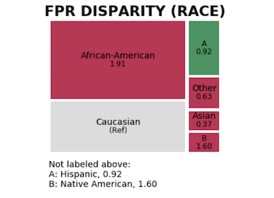

# The Bias and Fairness Audit Toolkit

Aequitas is an open-source bias audit toolkit for data scientists, machine learning researchers, and policymakers to audit machine learning models for discrimination and bias, and to make informed and equitable decisions around developing and deploying predictive tools.


[Visit the Aequitas project website](http://dsapp.uchicago.edu/aequitas/) 

[Try out the Aequitas web application](http://aequitas.dssg.io/) 


[Try out our interact colab notebook using the COMPAS dataset.](https://colab.research.google.com/github/dssg/aequitas/blob/update_compas_notebook/docs/source/examples/compas_demo.ipynb)


## Documentation

You can find the toolkit documentation [here](https://dssg.github.io/aequitas/).

For usage examples of the python library, see our [demo notebook](https://colab.research.google.com/github/dssg/fairness_tutorial/blob/master/notebooks/single_model_audit.ipynb) from the KDD 2020 hands-on tutorial. Alternatively, have a look to
[COMPAS notebook](https://colab.research.google.com/github/dssg/aequitas/blob/update_compas_notebook/docs/source/examples/compas_demo.ipynb) using Aequitas on the ProPublica COMPAS Recidivism Risk Assessment dataset.


## Installation


Aequitas is compatible with: **Python 3.6+**

Install Aequitas using pip:

    pip install aequitas


**If pip fails**, try installing master from source:

    git clone https://github.com/dssg/aequitas.git
    cd aequitas
    python setup.py install
(Note: be mindful of the python version you use to run setup.py)

You may then import the ``aequitas`` module from Python:

    import aequitas

...or execute the auditor from the command line:

    aequitas-report

...or launch the Web front-end from the command line (localhost):

    python -m serve


### Containerization

To build a Docker container of Aequitas:

    docker build -t aequitas .

...or simply via ``manage``:

    manage container build

The Docker image's container defaults to launching the development Web server, though this can be overridden via the Docker "command" and/or "entrypoint".

To run such a container, supporting the Web server, on-the-fly:

    docker run -p 5000:5000 -e "HOST=0.0.0.0" aequitas

...or, manage a development container via ``manage``:

    manage container [create|start|stop]

To contact the team, please email us at [aequitas at uchicago dot edu]

### Aequitas Group Metrics
Below are descriptions of the absolute bias metrics calculated by Aequitas.

| Metric                        | Formula                                                                           | Description                                                                                                   | 
|-------------------------------|-----------------------------------------------------------------------------------|---------------------------------------------------------------------------------------------------------------| 
| **Predicted Positive**        |                                                                            | The number of entities within a group where the decision is positive, i.e.,                  | 
| **Total Predictive Positive** |                                       | The total number of entities predicted positive across groups defined by                                | 
| **Predicted Negative**        |                                                                              | The number of entities within a group which decision is negative, i.e.,                       | 
| **Predicted Prevalence**      |      | The fraction of entities within a group which were predicted as positive.                                     | 
| **Predicted Positive Rate**   |          | The fraction of the entities predicted as positive that belong to a certain group.                            | 
| **False Positive**            |                                                                             | The number of entities of the group with  and                                            | 
| **False Negative**            |                                                                             | The number of entities of the group with  and                                            | 
| **True Positive**             |                                                                             | The number of entities of the group with  and                                           | 
| **True Negative**             |                                                                             | The number of entities of the group with  and                                           | 
| **False Discovery Rate**      |   | The fraction of false positives of a group within the predicted positive of the group.                        | 
| **False Omission Rate**       |   | The fraction of false negatives of a group within the predicted negative of the group.                        | 
| **False Positive Rate**       |  | The fraction of false positives of a group within the labeled negative of the group.                          | 
| **False Negative Rate**       |   | The fraction of false negatives of a group within the labeled positives of the group.                         | 

Each bias disparity  for a given group  is calculated as follows:


## 30 Seconds to Aequitas


**Python API**

Detailed instructions are [here](https://dssg.github.io/aequitas/using_python.html).

To get started, preprocess your input data. Input data has slightly different requirements depending on whether you are using Aequitas via the webapp, CLI or Python package. See [general input requirements](#input-data) and specific requirements for the [web app](#input-data-for-webapp), [CLI](#input-data-for-cli), and [Python API](#input-data-for-python-api) in the section immediately below.

If you plan to bin or discretize continuous features manually, note that `get_crosstabs()` expects attribute columns to be of type 'string,' so don't forget to recast any 'categorical' type columns!
``` python
    from aequitas.preprocessing import preprocess_input_df
    
    # double-check that categorical columns are of type 'string'
    df['categorical_column_name'] = df['categorical_column_name'].astype(str)
    
    df, _ = preprocess_input_df(*input_data*)
``` 
The Aequitas ``Group()`` class creates a crosstab of your preprocessed data, calculating absolute group metrics from score and label value truth status (true/ false positives and true/ false negatives)

``` python
    from aequitas.group import Group
    
    g = Group()
    xtab, _ = g.get_crosstabs(df)
``` 

The `Plot()` class can visualize a single group metric with `plot_group_metric()`, or a list of bias metrics with `plot_group_metric_all()`.
Suppose you are interested in False Positive Rate across groups. We can visualize this metric in Aequitas: 
``` python
    from aequitas.plotting import Plot
    
    aqp = Plot()
    fpr_plot = aqp.plot_group_metric(xtab, 'fpr')
``` 


There are some very small groups in this data set, for example 18 and 32 samples in the Native American and Asian population groups, respectively.

Aequitas includes an option to filter out groups under a minimum group size threshold, as very small group size may be a contributing factor in model error rates: 
``` python
    from aequitas.plotting import Plot
    
    aqp = Plot()
    fpr_plot = aqp.plot_group_metric(xtab, 'fpr', min_group_size=0.05)
``` 



The crosstab dataframe is augmented by every succeeding class with additional layers of information about biases, starting with bias disparities in the ``Bias()`` class. There are three ``get_disparity`` functions, one for each of the three ways to select a reference group. ``get_disparity_min_metric()`` and ``get_disparity_major_group()`` methods calculate a reference group automatically based on your data, while the user specifies reference groups for ``get_disparity_predefined_groups()``.
``` python
    from aequitas.bias import Bias
    
    b = Bias()
    bdf = b.get_disparity_predefined_groups(xtab, 
                        original_df=df, 
                        ref_groups_dict={'race':'Caucasian', 'sex':'Male', 'age_cat':'25 - 45'}, 
                        alpha=0.05, 
                        check_significance=False)
``` 
[Learn more about reference group selection.](https://dssg.github.io/aequitas/config.html)


The ``Plot()`` class visualizes disparities as treemaps colored based on disparity relationship between a given group and the reference group with ``plot_disparity()`` or multiple with ``plot_disparity_all()``. Saturation is determined by a given [fairness threshold](https://dssg.github.io/aequitas/config.html).

Let's look at False Positive Rate Disparity. 
``` python
    fpr_disparity = aqp.plot_disparity(bdf, group_metric='fpr_disparity', 
                                       attribute_name='race')
``` 



Now you're ready to obtain metric parities with the ``Fairness()`` class:
``` python
    from aequitas.fairness import Fairness
    
    f = Fairness()
    fdf = f.get_group_value_fairness(bdf)
``` 
You now have parity determinations for your models that can be leveraged in model selection!  If a specific bias metric for a group falls within a given percentage (based on the fairness threshold) of the reference group, the fairness determination is 'True.'

To determine whether group False Positive Rates fall within the "fair" range, use ``Plot()`` class fairness methods:
``` python
    fpr_fairness = aqp.plot_fairness_group(fdf, group_metric='fpr', title=True)
``` 




To quickly review False Positive Rate Disparity fairness determinations, we can use ``Plot()`` class ``fairness_disparity()`` methods:
``` python
    fpr_disparity_fairness = aqp.plot_fairness_disparity(fdf, group_metric='fpr', attribute_name='race')
``` 




### Input Data

In general, input data is a single table with the following columns:

- ``score``
- ``label_value`` (for error-based metrics only)
- at least one attribute e.g. ``race``, ``sex`` and ``age_cat`` (attribute categories defined by user)

|  score 	| label_value  	| race  	|  sex 	|   age	|   income	|
|---	|---	|---	|---	|---	|---	|
| 0  	|  1 	|   African-American	| Female  	| 27  	|   18000	|
| 1  	|  1 	|   Caucasian	|   	|   Male	|   32	| 45000


[Back to 30 Seconds to Aequitas](#30-seconds-to-aequitas)

#### Input data for Webapp


The webapp requires a single CSV with columns for a binary ``score``, a binary ``label_value`` and an arbitrary number of attribute columns. Each row is associated with a single observation.


##### `score`

Aequitas webapp assumes the ``score`` column is a binary decision (0 or 1).


##### `label_value`

This is the ground truth value of a binary decision. The data again must be binary 0 or 1.


##### `attributes` (e.g. ``race``, ``sex``, ``age``, ``income``)

Group columns can be categorical or continuous. If categorical, Aequitas will produce crosstabs with bias metrics for each group_level. If continuous, Aequitas will first bin the data into quartiles and then create crosstabs with the newly defined categories.

[Back to 30 Seconds to Aequitas](#30-seconds-to-aequitas)


####  Input data for CLI


The CLI accepts CSV files and accommodates database calls defined in Configuration files.


##### `score`

By default, Aequitas CLI assumes the ``score`` column is a binary decision (0 or 1). Alternatively, the ``score`` column can contain the score (e.g. the output from a logistic regression applied to the data). In this case, the user sets a threshold to determine the binary decision. [See configurations](https://dssg.github.io/aequitas/config.html) for more on thresholds.


##### `label_value`

As with the webapp, this is the ground truth value of a binary decision. The data must be binary 0 or 1.


##### attributes (e.g. ``race``, ``sex``, ``age``, ``income``)

Group columns can be categorical or continuous. If categorical, Aequitas will produce crosstabs with bias metrics for each group value. If continuous, Aequitas will first bin the data into quartiles.

##### `model_id`

``model_id`` is an identifier tied to the output of a specific model. With a ``model_id`` column you can test the bias of multiple models at once. This feature is available using the CLI or the Python package.


##### Reserved column names:


* ``id``
* ``model_id``
* ``entity_id``
* ``rank_abs``
* ``rank_pct``


[Back to 30 Seconds to Aequitas](#30-seconds-to-aequitas)


#### Input data for Python API

Python input data can be handled identically to CLI by using ``preprocess_input_df()``. Otherwise, you must discretize continuous attribute columns prior to passing the data to ``Group().get_crosstabs()``.

``` python
    from Aequitas.preprocessing import preprocess_input_df()
    # *input_data* matches CLI input data norms.
    df, _ = preprocess_input_df(*input_data*)
``` 


##### ``score``

By default, Aequitas assumes the ``score`` column is a binary decision (0 or 1). If the ``score`` column contains a non-binary score (e.g. the output from a logistic regression applied to the data), the user sets a threshold to determine the binary decision. Thresholds are set in a dictionary passed to `get_crosstabs()` of format {'rank_abs':[300] , 'rank_pct':[1.0, 5.0, 10.0]}. [See configurations](https://dssg.github.io/aequitas/config.html) for more on thresholds.

##### ``label_value``

This is the ground truth value of a binary decision. The data must be binary (0 or 1).


##### attributes (e.g. ``race``, ``sex``, ``age``, ``income``)

Group columns can be categorical or continuous. If categorical, Aequitas will produce crosstabs with bias metrics for each group_level. If continuous, Aequitas will first bin the data into quartiles.

If you plan to bin or discretize continuous features manually, note that ``get_crosstabs()`` expects attribute columns to be of type 'string'. This excludes the ``pandas`` 'categorical' data type, which is the default output of certain ``pandas`` discretizing functions. You can recast 'categorical' columns to strings:

```python 
   df['categorical_column_name'] = df['categorical_column_name'].astype(str)
``` 

##### ``model_id``

``model_id`` is an identifier tied to the output of a specific model. With a ``model_id`` column you can test the bias of multiple models at once. This feature is available using the CLI or the Python package.


##### Reserved column names:

* ``id``
* ``model_id``
* ``entity_id``
* ``rank_abs``
* ``rank_pct``


[Back to 30 Seconds to Aequitas](#30-seconds-to-aequitas)


### Development


Provision your development environment via the shell script ``develop``:

    ./develop

Common development tasks, such as deploying the webapp, may then be handled via ``manage``:

    manage --help

## Citing Aequitas


If you use Aequitas in a scientific publication, we would appreciate citations to the following paper:

Pedro Saleiro, Benedict Kuester, Abby Stevens, Ari Anisfeld, Loren Hinkson, Jesse London, Rayid Ghani, Aequitas: A Bias and Fairness Audit Toolkit,  arXiv preprint arXiv:1811.05577 (2018). ([PDF](https://arxiv.org/pdf/1811.05577.pdf))

```bib
   @article{2018aequitas,
     title={Aequitas: A Bias and Fairness Audit Toolkit},
     author={Saleiro, Pedro and Kuester, Benedict and Stevens, Abby and Anisfeld, Ari and Hinkson, Loren and London, Jesse and Ghani, Rayid}, journal={arXiv preprint arXiv:1811.05577}, year={2018}}
``` 
