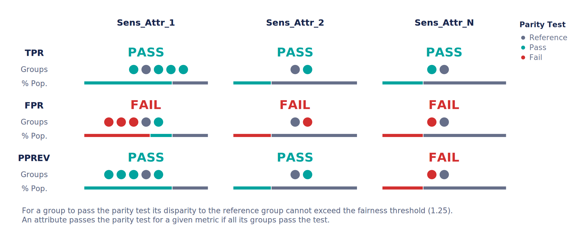
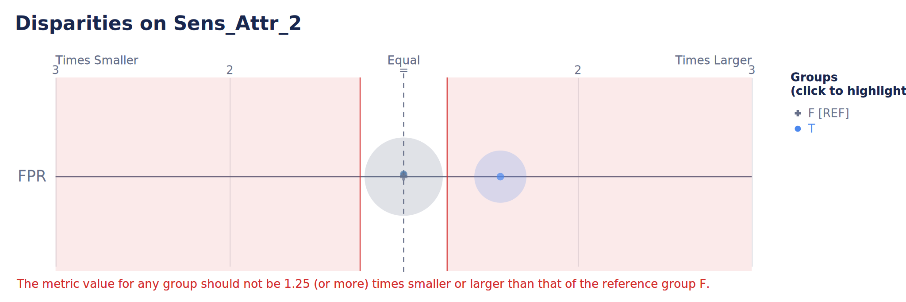

Getting Started with Aequitas Flow
==================================

Welcome to the Aequitas Flow API! This guide will help you take your first steps with the Aequitas Flow tools. Follow these instructions to begin experimenting with fair ML.

Installation
------------

Before you can start using the Aequitas Flow API, you need to install it in your environment. You can install the package from source:

.. code-block:: bash

    python setup.py install

Or named as an installation requirement, *e.g.* via ``pip``:

.. code-block:: bash

    pip install aequitas

.. code-block:: bash

    pip install git+https://github.com/dssg/aequitas.git

Example Notebooks
----------------------------------------------------------

We curated a series of Google Colab Notebooks to help you dive deeper into various tasks and workflows:

- `Audit a Model's Predictions <https://colab.research.google.com/github/dssg/aequitas/blob/notebooks/compas_demo.ipynb>`_ : Check how to do an in-depth bias audit with the COMPAS example notebook or use your own data. 
- `Correct a Model's Predictions <https://colab.research.google.com/github/dssg/aequitas/blob/notebooks/aequitas_flow_model_audit_and_correct.ipynb>`_ :  Create a dataframe to audit a specific model, and correct the predictions with group-specific thresholds in the Model correction notebook. 
- `Train a Model with Fairness Considerations <https://colab.research.google.com/github/dssg/aequitas/blob/notebooks/aequitas_flow_experiment.ipynb>`_ :  Experiment with your own dataset or methods and check the results of a Fair ML experiment. 
- `Add your method to Aequitas Flow <https://colab.research.google.com/github/dssg/aequitas/blob/notebooks/aequitas_flow_add_method.ipynb>`_ :  Learn how to add your own method to the Aequitas Flow toolkit. 

Quickstart on Bias Auditing
---------------------------

To perform a bias audit, you need a pandas `DataFrame` with the following format:

.. list-table:: Example DataFrame
   :widths: 25 25 25 25 25 10 25
   :header-rows: 1

   * - 
     - label
     - score
     - sens_attr_1
     - sens_attr_2
     - ...
     - sens_attr_N
   * - 0   
     - 0
     - 0     
     - A           
     - F        
     - ...    
     - Y
   * - 1   
     - 0     
     - 1     
     - C           
     - F           
     -  ...    
     - N
   * - 2   
     - 1     
     - 1     
     - B           
     - T         
     - ...    
     - N 
   * - ...   
     -      
     -      
     -          
     -          
     -     
     - 
   * - N   
     - 1     
     - 0     
     - E           
     - T           
     -  ...    
     - Y  

where `label` is the target variable for your prediction task and `score` is the model output.
Only one sensitive attribute is required; all must be in `Categorical` format.

.. code-block:: python

    from aequitas import Audit

    audit = Audit(df)

To obtain a summary of the bias audit, run:

.. code-block:: python
    
    # Select the fairness metric of interest for your dataset
    audit.summary_plot(["tpr", "fpr", "pprev"])

We can also observe a single metric and sensitive attribute:

.. code-block:: python
    
    audit.disparity_plot(attribute="sens_attr_2", metrics=["fpr"])

Quickstart on experimenting with Bias Reduction (Fair ML) methods
-----------------------------------------------------------------

To perform an experiment, a dataset is required. It must have a label column, a sensitive attribute column, and features.  

.. code-block:: python
    
    from aequitas.flow import DefaultExperiment

    experiment = DefaultExperiment.from_pandas(dataset, target_feature="label", sensitive_feature="attr", experiment_size="small")
    experiment.run()

    experiment.plot_pareto()

.. image:: ../_images/pareto_example.png

The ``DefaultExperiment`` class allows for an easier entry-point to experiments in the package. 
This class has two main parameters to configure the experiment: ``experiment_size`` and ``methods``. 
The former defines the size of the experiment, which can be either `test` (1 model per method), `small` (10 models per method), `medium` (50 models per method), or `large` (100 models per method). 
The latter defines the methods to be used in the experiment, which can be either `all` or a subset, namely `preprocessing` or `inprocessing`.

Several aspects of an experiment (*e.g.*, algorithms, number of runs, dataset splitting) can be configured individually in more granular detail in the ``Experiment`` class.

Quickstart on Method Training
-----------------------------

Assuming an ``aequitas.flow.Dataset``, it is possible to train methods and use their functionality depending on the type of algorithm (pre-, in-, or post-processing).

For pre-processing methods:

.. code-block:: python
    
    from aequitas.flow.methods.preprocessing import PrevalenceSampling

    sampler = PrevalenceSampling()
    sampler.fit(dataset.train.X, dataset.train.y, dataset.train.s)
    X_sample, y_sample, s_sample = sampler.transform(dataset.train.X, dataset.train.y, dataset.train.s)

For in-processing methods:

.. code-block:: python
    
    from aequitas.flow.methods.inprocessing import FairGBM

    model = FairGBM()
    model.fit(X_sample, y_sample, s_sample)
    scores_val = model.predict_proba(dataset.validation.X, dataset.validation.y, dataset.validation.s)
    scores_test = model.predict_proba(dataset.test.X, dataset.test.y, dataset.test.s)

For post-processing methods:

.. code-block:: python
    
    from aequitas.flow.methods.postprocessing import BalancedGroupThreshold

    threshold = BalancedGroupThreshold("top_pct", 0.1, "fpr")
    threshold.fit(dataset.validation.X, scores_val, dataset.validation.y, dataset.validation.s)
    corrected_scores = threshold.transform(dataset.test.X, scores_test, dataset.test.s)

With this sequence, we would sample a dataset, train a FairGBM model, and then adjust the scores to have equal FPR per group (achieving Predictive Equality).

Next Steps
----------
- **Further learning**: For more examples of the python library and a deep dive into concepts of fairness in ML, see our `Tutorial <https://github.com/dssg/fairness_tutorial>`_ presented on KDD and AAAI. 
- **About the project**: Visit the `Aequitas project website <http://dsapp.uchicago.edu/aequitas/>`_.
- **Explore the Documentation**: Check out the various modules available in Aequitas Flow through the API documentation.
- **Join the Community**: Get involved with other users and developers on our `GitHub page <https://github.com/dssg/aequitas>`_.

Congratulations, you are now ready to use Aequitas Flow for your fair ML experiments!

